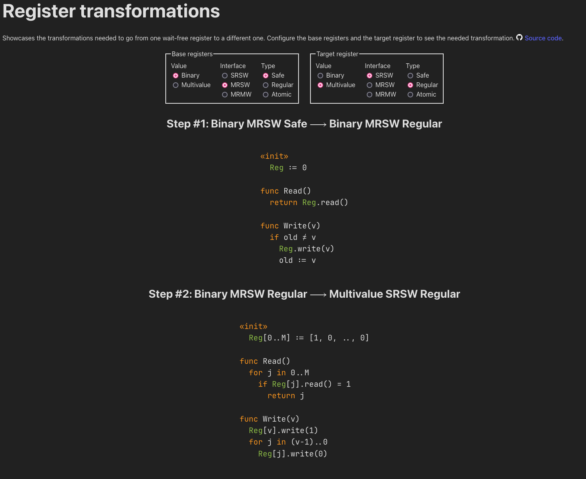

# Register transformations

Showcases the transformations needed to go from one wait-free register to a different one. Configure the base registers and the target output register to see the needed transformation. [See website here](https://github.shilangyu.dev/register-transformations).

<!-- TODO screenshot -->

## What is a wait-free register?

A register is a shared-object with two atomic operations: read and write. It is shared across many threads. A [wait-free](https://en.wikipedia.org/wiki/Non-blocking_algorithm#Wait-freedom) operation is an operation such that when invoked we have a guarantee that it will eventually be completed.

A register can come in many flavors, but here we consider those that have three characteristics:

1. **Value**: _binary_ (can represent two state), _multivalue_ (can represent many values)
2. **Interface**: _SRSW_ (single reader, single writer), _MRSW_ (multiple reader, single writer), _MRMW_ (multiple reader, multiple writer)
3. **Type**: _safe_ (a read that is concurrent with a write can return anything), _regular_ (a read that is concurrent with a write can return the value being written or the previously written value), _atomic_ (all operations appear to be executed instantaneously)

This website shows how to construct a stronger register using weaker ones.
